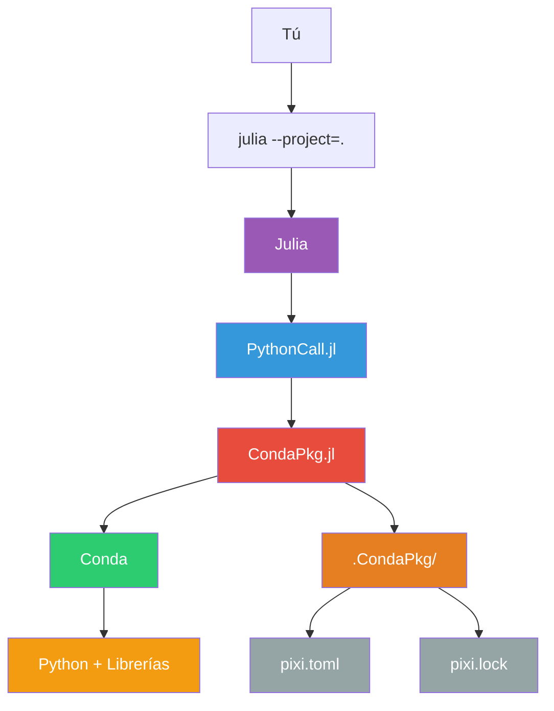

# Julia_Curso_Completo 🚀

> Aprende Julia desde cero hasta nivel profesional con ejercicios, notebooks y proyectos reales. Todo organizado y visualmente atractivo.


## 📚 Estructura del curso

| Carpeta                | Contenido principal                                                                 |
|------------------------|-----------------------------------------------------------------------------------|
| **00_PREREQUISITOS**   | Instalación, introducción, comparación con Python                                  |
| **01_FUNDAMENTOS**     | Variables, tipos, operaciones, estructuras, condicionales, bucles, funciones, etc. |
| **02_CONCEPTOS_INTERMEDIOS** | Ejercicios y proyectos intermedios                                      |
| **03_TRANSICION_AVANZADA**   | Performance, type stability, macros, manejo de archivos y paquetes externos |
| **04_CONCEPTOS_AVANZADOS**   | Temas avanzados, ejemplos prácticos, optimización, integración              |
| **05_INTEGRACION_PYTHON**    | Ejemplos con PyCall y PythonCall                                            |
| **06_ETL_DATOS**             | Procesamiento de CSV, JSON, Excel                                           |
| **07_RECURSOS**              | Glosario, errores frecuentes, patrones comunes, recursos extra              |
| **08_VISUALIZACION**         | Gráficos avanzados con Plots y Makie                                        |
| **09_TESTING_DOCS**          | Testing y documentación profesional                                         |
| **10_MINIPROYECTOS**         | Mini-proyectos aplicados: análisis de datos, simulaciones, ML básico        |
| **modules/components/utils** | Ejemplos de módulos, submódulos y scripts reutilizables                     |


## ✨ ¿Por qué elegir este curso?


## 🛠️ Configuración del Entorno

Este curso utiliza un **proyecto Julia** para garantizar que todas las dependencias estén correctamente instaladas y sean reproducibles.

### 📥 Paso 1: Obtener el Curso

#### Opción A: Clonar con Git (Recomendado)
```bash
git clone https://github.com/tu-usuario/Julia_Curso_Completo.git
cd Julia_Curso_Completo
```
**Ventajas:**
- ✅ Puedes recibir actualizaciones con `git pull`
- ✅ Puedes contribuir al curso
- ✅ Mantiene el historial completo

#### Opción B: Descargar como ZIP
1. Ve al repositorio en GitHub
2. Haz clic en "Code" → "Download ZIP"
3. Descomprime el archivo en una carpeta
4. Abre esa carpeta en tu terminal

**Ventajas:**
- ✅ No necesitas Git instalado
- ✅ Descarga única y rápida
- ✅ Ideal para aprendizaje offline

### 🔧 Paso 2: ¿Qué es `julia --project=.`?

Este es el comando más importante del curso. Entiéndelo bien:

#### ¿Qué hace exactamente?
```bash
julia --project=.
```

**El Punto (`.`):** Significa "directorio actual"
**`--project`:** Le dice a Julia que active el modo de proyecto

#### ¿Qué pasa internamente?

1. **🔍 Búsqueda:** Julia busca archivos `Project.toml` y `Manifest.toml` en el directorio actual
2. **🏗️ Construcción:** Si no existen, crea un entorno virtual aislado
3. **📦 Instalación:** Lee `Project.toml` e instala automáticamente las dependencias
4. **🔒 Bloqueo:** Usa `Manifest.toml` para asegurar versiones exactas
5. **🚀 Activación:** Prepara el entorno para ejecutar código

#### Visualización del Proceso:
```
Tu Computadora                           Internet
┌─────────────────┐                   ┌──────────────┐
│ Julia Global    │  -- NO USA -->    │   Paquetes   │
│ (instalación)   │                   │    Online    │
└─────────────────┘                   └──────────────┘
        ↑                                        ↑
        │                                        │
┌─────────────────┐  -- USA -->  ┌──────────────────┐
│ Julia Proyecto  │              │  Paquetes Cache  │
│ (este curso)    │◄─────────────│   locales        │
│ ┌─────────────┐ │              │                  │
│ │ Plots       │ │              └──────────────────┘
│ │ PythonCall  │ │
│ │ HTTP        │ │  ← Aislado, reproducible
│ │ JSON        │ │
│ └─────────────┘ │
└─────────────────┘
```

### 🎯 Paso 3: Formas de Usar el Proyecto

#### Método 1: REPL Interactivo (Más común)
```bash
julia --project=.
```
Luego en el REPL de Julia:
```julia
using Plots
x = 1:10
y = x.^2
plot(x, y)
```

#### Método 2: Ejecutar Archivos Directamente
```bash
julia --project=. 08_VISUALIZACION/plots_basico.jl
```

#### Método 3: Modo Script (para automatización)
```bash
julia --project=. -e "using Plots; plot(1:10, (1:10).^2); saveplot(\"test.png\")"
```

### 🎨 Paso 4: Personalización y Alias

#### Crear Alias para Facilitar Uso

**En Windows (PowerShell):**
```powershell
# Agrega a tu perfil $PROFILE
function julia-curso { julia --project=. $args }
Set-Alias -Name jc -Value julia-curso
```

**En Linux/Mac (bash/zsh):**
```bash
# Agrega a ~/.bashrc o ~/.zshrc
alias jc='julia --project=.'
alias julia-curso='julia --project=.'
```

**Uso con alias:**
```bash
jc                                    # Inicia REPL
jc 08_VISUALIZACION/plots_basico.jl   # Ejecuta archivo
```

#### Scripts de Inicio Rápido

**`start_julia.sh` (Linux/Mac):**
```bash
#!/bin/bash
cd "$(dirname "$0")"
julia --project=. "$@"
```

**`start_julia.bat` (Windows):**
```batch
@echo off
cd /d "%~dp0"
julia --project=. %*
```

### 🐍 Paso 5: ¿Por qué Conda/PythonCall?

#### ¿Qué es CondaPkg?

**CondaPkg** es el **puente** entre Julia y Conda. Es un paquete Julia que:

- 🌉 **Actúa como traductor:** Convierte necesidades de paquetes Julia a comandos Conda
- 📦 **Gestia automáticamente:** Instala Python y paquetes Python sin que tengas que tocar Conda directamente
- 🔒 **Crea aislamiento:** Cada proyecto Julia tiene su propio entorno Python completamente separado

#### Visualización del Flujo Completo:



#### ¿Qué hace CondaPkg específicamente?

1. **🔍 Análisis de dependencias:**
   ```julia
   # Cuando haces:
   using PythonCall

   # CondaPkg detecta que necesita:
   # - Python intérprete
   # - Librerías específicas que PythonCall requiere
   ```

2. **📝 Generación de configuración:**
   ```toml
   # CondaPkg crea automáticamente .CondaPkg/pixi.toml:
   [dependencies.python]
   channel = "conda-forge"
   version = ">=3.9,<4"
   ```

3. **🚀 Ejecución de Conda:**
   ```bash
   # CondaPkg ejecuta automáticamente (tú no ves esto):
   conda create -n .CondaPkg python=3.11
   conda install -n .CondaPkg numpy pandas matplotlib
   ```

4. **🔗 Configuración del puente:**
   ```julia
   # CondaPkg le dice a PythonCall dónde encontrar el Python:
   ENV["PYTHON"] = "/ruta/a/.CondaPkg/envs/default/bin/python"
   ```

#### ¿Por qué no usar directamente el Python de mi sistema?

| Python del Sistema | CondaPkg + PythonCall |
|-------------------|------------------------|
| ❌ Puede ser cualquier versión | ✅ Versión controlada y compatible |
| ❌ Librerías pueden faltar | ✅ Todas las librerías necesarias |
| ❌ Conflictos entre proyectos | ✅ Aislamiento completo por proyecto |
| ❌ Diferente en Windows/Mac/Linux | ✅ Comportamiento idéntico en todos lados |
| ❌ Requiere instalación manual | ✅ Automático y transparente |

#### ¿Qué es Conda entonces?

**Conda** es el motor subyacente que:
- 🐍 **Instala Python:** Descarga el intérprete Python
- 📚 **Gestiona paquetes Python:** numpy, pandas, matplotlib, etc.
- 🏗️ **Crea entornos virtuales:** Aísla las dependencias
- 🔧 **Resuelve conflictos:** Encuentra versiones compatibles

**CondaPkg es como el "chofer" que maneja el "carro" (Conda) por ti.**

#### ¿Qué pasa la primera vez?

```bash
# Cuando ejecutas por primera vez:
julia --project=. -e "using PythonCall"

# VERÁS ESTO (es normal):
CondaPkg Resolving changes...     # 🔍 Analizando qué necesita
CondaPkg Installing packages...   # 📦 Descargando Python y librerías
CondaPkg Found dependencies...   # ✅ Todo listo para usar

# PROCESO INTERNO (automático):
# 1. Crear carpeta .CondaPkg/
# 2. Generar pixi.toml con configuración
# 3. Descargar Python (≈50MB)
# 4. Instalar librerías necesarias
# 5. Configurar puente Julia-Python
```

**¿Cuánto tiempo tarda?**
- Primera vez: 2-10 minutos (depende de tu internet)
- Siguientes veces: 5-10 segundos (solo verificar)

#### ¿Dónde se guarda todo?

```
tu_carpeta/
├── .CondaPkg/              # ← Aquí está todo lo de Python
│   ├── pixi.toml          # Configuración del entorno
│   ├── pixi.lock          # Versiones exactas (como Manifest.toml)
│   └── envs/              # Python instalado (~200MB)
│       └── default/
│           ├── bin/python
│           └── lib/python3.11/
├── Project.toml           # ← Paquetes Julia
├── Manifest.toml          # ← Versiones Julia exactas
└── tus_archivos.jl
```

#### ¿Puedo usar librerías Python adicionales?

¡Sí! CondaPkg las detecta automáticamente:

```julia
# En tu código Julia:
using PythonCall
pd = pyimport("pandas")      # ← CondaPkg instalará pandas automáticamente
np = pyimport("numpy")       # ← CondaPkg instalará numpy
plt = pyimport("matplotlib") # ← CondaPkg instalará matplotlib

# CondaPkg hace:
# 1. "Oh, necesita pandas"
# 2. "Ejecutando: conda install pandas"
# 3. "Listo, pandas está disponible"
```

### 📦 Dependencias del Proyecto

El proyecto incluye automáticamente estos paquetes:

#### Paquetes Principales:
- **Plots** - Visualización de datos y gráficos
- **PythonCall** - Integración con Python y sus librerías
- **HTTP** - Peticiones web y consumo de APIs
- **JSON** - Procesamiento de archivos JSON

#### Librerías Estándar Ampliadas:
- **LinearAlgebra** - Operaciones matriciales avanzadas
- **Statistics** - Funciones estadísticas
- **Random** - Generación de números aleatorios
- **Dates** - Manejo avanzado de fechas y tiempos

#### Paquetes de Soporte (instalados automáticamente):
- **GR** - Backend para gráficos
- **Measures** - Unidades para gráficos
- **StatsBase** - Funciones estadísticas básicas
- **Y muchos más...** (ver `Manifest.toml`)

### 🚀 Paso 6: Primeros Pasos

1. **Instala Julia (v1.8+)** desde [julialang.org](https://julialang.org/downloads/)

2. **Obtén el curso** (clonando o descargando)

3. **Activa el entorno del proyecto**:
   ```bash
   julia --project=.
   ```

4. **Verifica la instalación** (dentro de Julia REPL):
   ```julia
   using Pkg
   Pkg.status()  # Muestra todos los paquetes instalados
   ```

## 🛠️ Cómo usar el Curso

### Uso Diario

1. **Activa el entorno** cada vez que trabajes con el curso:
   ```bash
   julia --project=.
   # o con alias:
   jc
   ```

2. **Explora las carpetas** según tu nivel y tema de interés

3. **Ejecuta los ejercicios** y notebooks para practicar

4. **Los archivos .jl se ejecutan** con:
   ```bash
   julia --project=. archivo.jl
   # o con alias:
   jc archivo.jl
   ```

### Flujo de Trabajo Recomendado

```bash
# 1. Inicia tu sesión
julia --project=.

# 2. En Julia REPL, carga lo que necesites
using Plots
using PythonCall

# 3. Trabaja en los ejercicios
include("01_FUNDAMENTOS/basico/Ejercicios/001_variables_y_tipos.jl")

# 4. Prueba conceptos interactivamente
x = 1:100
y = sin.(x/10)
plot(x, y, title="Mi primer gráfico con Julia")
```

### Nota Importante
⚠️ **Siempre usa `julia --project=.`** para ejecutar cualquier archivo del curso. Esto asegura que todas las dependencias estén disponibles y funcionen correctamente.

### 💡 Tips Avanzados

- **Activa el proyecto automáticamente:** Crea un script que ejecute `julia --project=.`
- **Usa VSCode con extensión Julia:** Detecta automáticamente proyectos
- **Para desarrollo:** Usa `julia --project=. --threads=auto` para paralelización
- **Para debugging:** Usa `julia --project=. --compiled-modules=no`

## 🔧 Troubleshooting y Preguntas Frecuentes

### ❌ Problemas Comunes

#### Error: "Package not found"
```julia
# Si ves este error:
ERROR: ArgumentError: Package XXX not found in current project
```
**Solución:**
```bash
# Activa el proyecto correctamente
julia --project=.

# O instala el paquete manualmente
julia --project=. -e "using Pkg; Pkg.add(\"nombre_del_paquete\")"
```

#### Error: "PythonCall no funciona"
```julia
# Si ves errores relacionados con Python:
ERROR: InitError: PyError (PyImport_ImportModule)
```
**Solución:**
```bash
# Reinstala PythonCall completamente
julia --project=. -e "using Pkg; Pkg.rm(\"PythonCall\"); Pkg.add(\"PythonCall\")"
```

#### Error: "Manifest.toml conflicts"
```
WARNING: Manifest.toml conflicts with Project.toml
```
**Solución:**
```bash
# Regenera el manifest
julia --project=. -e "using Pkg; Pkg.resolve(); Pkg.instantiate()"
```

#### Error: "Paquetes no compilan"
```
ERROR: LoadError: LoadError: LoadError:
failed to precompile XXX
```
**Solución:**
```bash
# Limpia la caché y recompila
julia --project=. -e "using Pkg; Pkg.precompile()"

# Si persiste, borra compilados manualmente
rm -rf ~/.julia/compiled/v1.X/
```

### 🐛 Errores de Conda/PythonCall

#### Conda se queda atascado descargando
**Síntoma:** `CondaPkg Installing packages` se queda mucho tiempo

**Soluciones:**
```bash
# 1. Sé paciente, la primera vez puede tardar 5-10 minutos
# 2. Si falla, intenta de nuevo:
julia --project=. -e "using PythonCall"

# 3. Limpia y reintenta:
rm -rf .CondaPkg/
julia --project=. -e "using PythonCall"
```

#### Error de permisos en Windows
**Síntema:** `Access denied` o `PermissionError`

**Solución:**
- Ejecuta PowerShell/CMD como Administrador
- O mueve el curso a una carpeta sin restricciones (ej: `C:\JuliaCurso\`)

### 🔄 Mantenimiento del Proyecto

#### Actualizar paquetes
```bash
# Actualiza todo a las últimas versiones compatibles
julia --project=. -e "using Pkg; Pkg.update()"
```

#### Limpiar el entorno
```bash
# Elimina paquetes no usados
julia --project=. -e "using Pkg; Pgc()"  # Package garbage collector
```

#### Verificar estado del proyecto
```bash
# Revisa qué está instalado y si hay problemas
julia --project=. -e "using Pkg; Pkg.status()"
julia --project=. -e "using Pkg; Pkg.test()"
```

### 📱 Preguntas Frecuentes

#### **Q: ¿Puedo usar mi Julia global en lugar del proyecto?**
**A:** Sí, pero no recomendado. Perderás:
- ✅ Versiones garantizadas de paquetes
- ✅ Aislamiento del sistema
- ✅ Reproducibilidad exacta

#### **Q: ¿Por qué la primera instalación es tan lenta?**
**A:** Julia precompila todos los paquetes. Es una inversión que:
- Solo pasa una vez por paquete/versión
- Hace que las cargas futuras sean instantáneas
- Ocurre en segundo plano con `pkg precompile`

#### **Q: ¿Puedo usar este curso sin internet?**
**A:** Sí, después de la instalación inicial:
- Una vez instalados los paquetes, todo funciona offline
- Los archivos `.jl` son autocontenidos
- Solo necesitas internet para nuevas instalaciones

#### **Q: ¿Qué es `Manifest.toml` y puedo borrarlo?**
**A:** `Manifest.toml` es tu "foto" de versiones exactas:
- 📸 Congela las versiones de todas las dependencias
- 🔄 Asegura que funcione igual en cualquier computadora
- ⚠️ Puedes borrarlo, pero perderás reproducibilidad exacta

#### **Q: ¿Cómo sé si estoy usando el proyecto correctamente?**
**A:** En Julia REPL, el prompt debe mostrar:
```julia
(JuliaCursoCompleto) pkg>
#                 ^
#         Nombre del proyecto
```

### 🆘 Obtener Ayuda

Si encuentras un problema no cubierto aquí:

1. **Revisa los logs:** Julia muestra mensajes detallados de error
2. **Google el error:** Es probable que alguien más ya lo resolviera
3. **Issue en GitHub:** Reporta el problema en el repositorio del curso
4. **Comunidad Julia:** [Julia Discourse](https://discourse.julialang.org/)

### 🚀 Buenas Prácticas

#### Flujo de trabajo ideal:
```bash
# 1. Siempre inicia con el proyecto activado
julia --project=.

# 2. Carga solo lo que necesitas
using Plots, HTTP  # ✅ Bueno
# using LinearAlgebra, Statistics, Random, Dates, Plots, HTTP, JSON, PythonCall  # ❌ Evita

# 3. Guarda tu trabajo frecuentemente
# Julia no guarda automáticamente el estado

# 4. Cierra Julia limpiamente
# Usa exit() o Ctrl+D, no cierres la ventana directamente
```

#### Organización de archivos:
```
tu_proyecto_personal/
├── Project.toml          # Copia este del curso
├── Manifest.toml         # Opcional, para reproducibilidad
├── mis_ejercicios.jl     # Tus archivos
└── resultados/           # Guarda gráficos y datos aquí
```


## 📦 Recursos útiles


## 🤝 Contribuye
¿Tienes sugerencias, encuentras redundancias o quieres mejorar el curso?
¡Puedes contribuir enviando tus ideas, ejercicios o corrigiendo errores!


> **¡Disfruta aprendiendo Julia y lleva tus habilidades al siguiente nivel!** 🎉
# Julia_Curso_Completo 🚀

> Aprende Julia desde cero hasta nivel profesional con ejercicios, notebooks y proyectos reales. Todo organizado y visualmente atractivo.

---

## 📚 Estructura del curso

| Carpeta                | Contenido principal                                                                 |
|------------------------|-----------------------------------------------------------------------------------|
| **00_PREREQUISITOS**   | Instalación, introducción, comparación con Python                                  |
| **01_FUNDAMENTOS**     | Variables, tipos, operaciones, estructuras, condicionales, bucles, funciones, etc. |
| **02_CONCEPTOS_INTERMEDIOS** | Ejercicios y proyectos intermedios                                      |
| **03_TRANSICION_AVANZADA**   | Performance, type stability, macros, manejo de archivos y paquetes externos |
| **04_CONCEPTOS_AVANZADOS**   | Temas avanzados, ejemplos prácticos, optimización, integración              |
| **05_INTEGRACION_PYTHON**    | Ejemplos con PyCall y PythonCall                                            |
| **06_ETL_DATOS**             | Procesamiento de CSV, JSON, Excel                                           |
| **07_RECURSOS**              | Glosario, errores frecuentes, patrones comunes, recursos extra              |
| **08_VISUALIZACION**         | Gráficos avanzados con Plots y Makie                                        |
| **09_TESTING_DOCS**          | Testing y documentación profesional                                         |
| **10_MINIPROYECTOS**         | Mini-proyectos aplicados: análisis de datos, simulaciones, ML básico        |
| **modules/components/utils** | Ejemplos de módulos, submódulos y scripts reutilizables                     |

---

## ✨ ¿Por qué elegir este curso?
- Ejercicios progresivos y prácticos
- Notebooks interactivos (Pluto y Jupyter)
- Proyectos reales y mini-proyectos
- Recursos visuales y explicativos
- Ejemplos de integración y optimización
- Buenas prácticas y testing

---

## 🛠️ Cómo usar
1. Explora las carpetas según tu nivel y tema de interés
2. Ejecuta los ejercicios y notebooks para practicar
3. Consulta los recursos y glosarios para resolver dudas
4. Prueba los mini-proyectos y experimenta con tus propios datos

---

## 📦 Recursos útiles
- [Documentación oficial Julia](https://docs.julialang.org/)
- [Julia Academy](https://juliaacademy.com/)
- [Julia Discourse](https://discourse.julialang.org/)
- [Julia Packages](https://juliapackages.com/)
- [Pluto.jl](https://plutojl.org/)

---

## 🤝 Contribuye
¿Tienes sugerencias, encuentras redundancias o quieres mejorar el curso?
¡Puedes contribuir enviando tus ideas, ejercicios o corrigiendo errores!

---

> **¡Disfruta aprendiendo Julia y lleva tus habilidades al siguiente nivel!** 🎉
